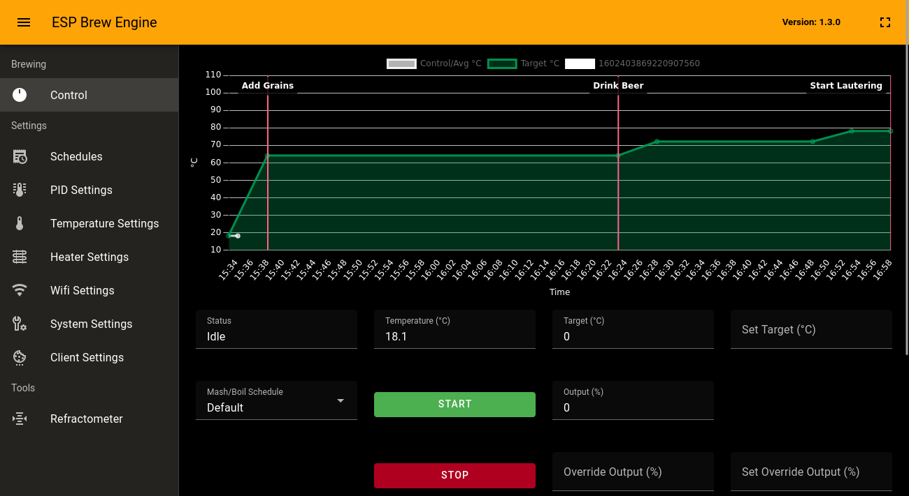
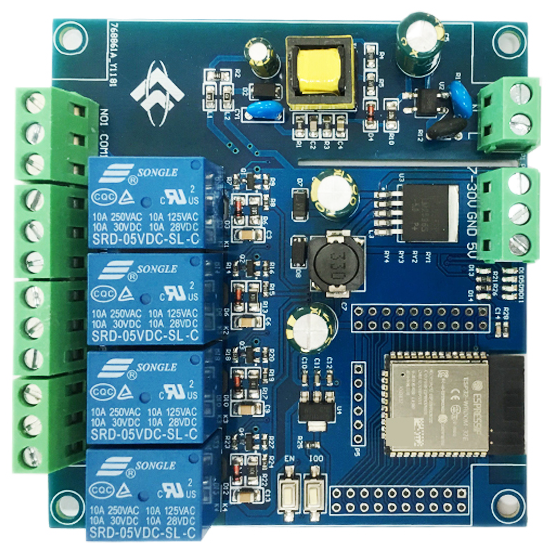

# ESP Brew Engine

## Description

ESP Brew Engine is a brew controller for ESP32, it can be used to control maish and cooking.

It is open source and build in c++ using esp-idf RTOS.

## Features

- Multiple Configurable Maish Schedules.
- Configurable PID control.
- Up to 10 Configurable Heaters.
- Up to 10 One-wire Sensors.
- Automatic Stirring / Pumping Intervals.
- Temperature logging to MQTT.
- OTA Firmware update.
- Ability to enable/disable/detect sensors at runtime.
- Ability to specify Absolute and Relative Compensation.
- Support for Celsius and Fahrenheit.
- Support for Buzzer.
- Support for Notifications.

## Screenshots




## Supported Devices

It should work with most esp32 controllers, but the easiest way is to use an esp board which already has 4 relays on it.




## How to use (binary with loader)

Its recomended to flash with loader, that way you can always go into recovery mode and flash new firmwares over wifi.

- Download the binary loader release (esp-brew-engine-loader-*.bin).
- Flash esp-brew-engine-loader_*.bin to esp using your favorite flash tool.
    - Tasmota-PyFlasher-1.0
    - https://espressif.github.io/esptool-js/ (address 0x0)
    - https://github.com/espressif/esptool/ (esptool write_flash 0x0 esp-brew-engine-loader_*.bin)
    - ...

- Download latest release (esp-brew-engine-*.bin) to computer.
- Reboot device
- Connect to the wifi EspBrewEngine with password EspBrewEngine123
- Navigate to http://192.168.4.1
- Flash release
- Wait for reboot
- Goto Settings -> Wifi and configure your wifi.
- Restart Device
- Navigate to http://brewengine/
- Start Brewing!
- Ship or buy me a beer!

## How to use (source with loader)

Its recomended to flash with loader, that way you can always go into recovery mode and flash new firmwares.

- Build and flash the loader.

```bash
cd loader
idf.py fullclean
idf.py set-target esp32
idf.py build flash monitor
```

- Connect to the wifi EspBrewEngine with password EspBrewEngine123
- Navigate to http://192.168.4.1
- Build latest release

```bash
idf.py fullclean
idf.py set-target esp32
idf.py build
```
- Flash release (build/esp-brew-engine.bin)
- Wait for reboot
- Goto Settings -> Wifi and configure your wifi.
- Restart Device
- Navigate to http://brewengine/
- Start Brewing!
- Ship or buy me a beer!

## How to use (source without loader)

- Build and flash.

```bash
idf.py fullclean
idf.py set-target esp32
idf.py build flash monitor
```
- Connect to the wifi EspBrewEngine with password EspBrewEngine123
- Navigate to http://192.168.4.1
- Goto Settings -> Wifi and configure your wifi.
- Restart Device
- Navigate to http://brewengine/
- Start Brewing!
- Ship or buy me a beer!

## Setup Dev Enviroment

install esp-idf >= 5.1.2

run . ./export.sh in esp-idf folder


## Configure the project

```bash
idf.py fullclean
```

```bash
idf.py set-target esp32   
```
valid targets are: esp32, esp32s2, esp32c3, esp32c6, esp32h2, esp32c2, esp32s3

```bash
idf.py menuconfig 
```

Go into "BrewEngine Config" and configure wifi and IO's.


## Build and Flash

Build the project and flash it to the board, then run monitor tool to view serial output:

```bash
idf.py build flash
```

*Depending on your device you might need to set it into flash mode, typically: Hold both the BOOT and RESET, then release RESET.


## Factory Reset

To factory reset the device and all the settings run the command below, you will then have to reflash the loader and app!

```bash
idf.py flash_erase
```


## Build Web (optional)

It is optional since the last build html should also be checked into git.

To update the web build:

```bash
cd web
yarn build
cd ..
./updateweb.sh
```

*on build issues first delete tsconfig.tsbuildinfo

## Wifi

To configure wifi either do idf.py menuconfig, and configure wifi SSID and password, or let esp-brew-engine start an access point wich you can connect to and configure wifi in the webinterface.

Be sure to at least change te password!, but it is also recommended to swith to station mode instead of ap!

Default Wifi settings are:
SSID: EspBrewEngine
Password: EspBrewEngine123

## Connecting with Browser

Just open your browser and enter http://BrewEngine, or if still in access point mode http://192.168.4.1

Hostname can also be changed via menuconfig.

*Dns does not work when in access point mode, esp-idf doesn't have a dns server atm. 


## Debug

```bash
idf.py monitor 
```

To quit Ctrl-T Ctrl-X.


## Connect sensors

```
┌──────────────────────────┐
│                      3.3V├───────┬─────────────┬──────────────────────┐
│                          │      ┌┴┐            │VDD                   │VDD
│          ESP Board       │  4.7k│ │     ┌──────┴──────┐        ┌──────┴──────┐
│                          │      └┬┘   DQ│             │      DQ│             │
│     ONEWIRE_GPIO_PIN (17)├───────┴──┬───┤   DS18B20   │    ┌───┤   DS18B20   │  
│                          │          └───│-------------│────┴───│-------------│──
│                          │              └──────┬──────┘        └──────┬──────┘
│                          │                     │GND                   │GND
│                       GND├─────────────────────┴──────────────────────┘
└──────────────────────────┘
```


## Planned Features (possible)

- Configureable Wattage per element.
- Backup and Restore config data.
- Resume maish from custom timepoint.
- Pauze function.
- Loading MaishSchedule from beer xml?, or online apps. (brewfather?)
- Notification of when to add hops or take action? (via webinterface speech?)
- Dns server so when in AP mode the resolving the hostname works.
- HW Display (show temp/target).
- HW Control Buttons (emergecy stop, stop/start stir?).